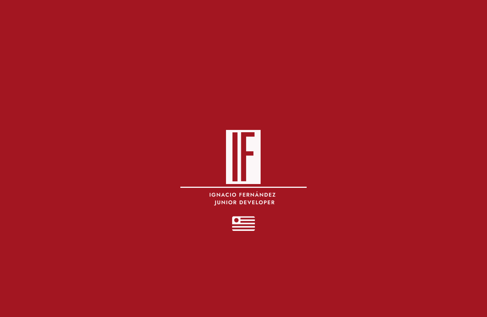

Hi! i'm Ignacio, a 21 years old Uruguayan 🇺🇾 student passionate about learning and working on coding and design.

I started this journey back on 2017, (although I remember using scratch at 6 years old in an OLPC), during my last 3 high school years I take the IT specialization and during those 3 years I've worked with: 

Java ☕
Visual Basics ⚙️
HTML & CSS 💻

I also learned about methodologies like SCRUM and very interestings things like UML.

Currently I'm on my second year of an IT technologist degree 👨‍💻, in the first year I used

Assembly 💾
C and C++ (mostly centered on memory managment) 🇨
Python 🐍

I'm learning by my own javascript and I already used it to create a recursive sudoku solver✏️ , and I'm planning a lot of projects that you can find here on my github profile!

I want to keep learning as much as posible so I can get myself a job on the development industry because is my dream and I'm really passionate about it.

<!---
SinKsa/SinKsa is a ✨ special ✨ repository because its `README.md` (this file) appears on your GitHub profile.
You can click the Preview link to take a look at your changes.
--->
